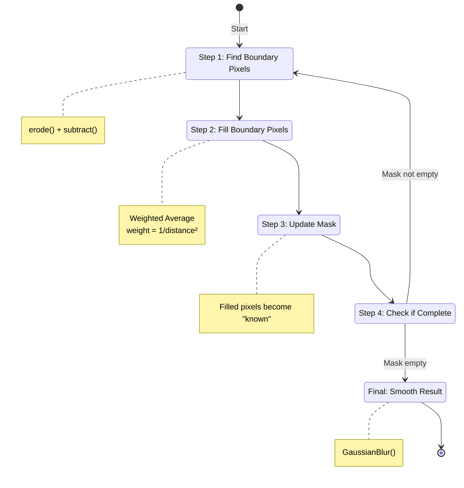
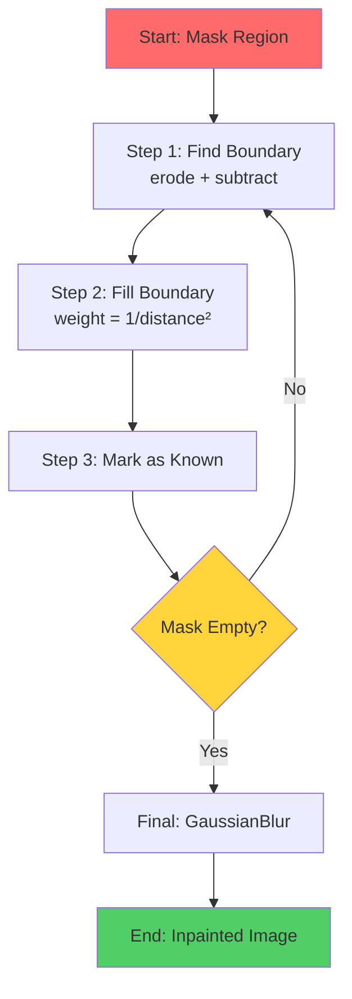
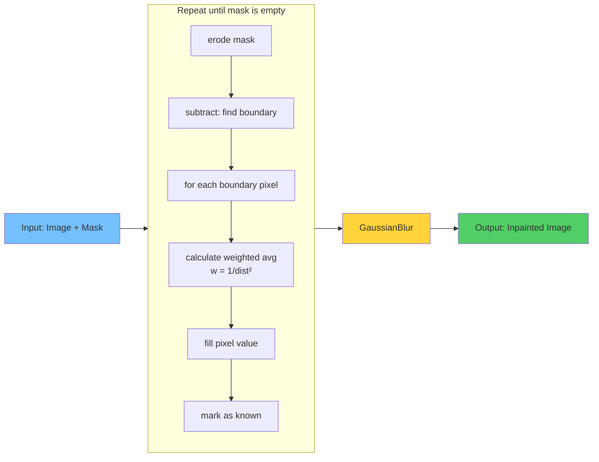

# Class Inpainting Algorithm Diagrams

## Version 1: State Diagram

```mermaid
stateDiagram-v2
    [*] --> FindBoundary: Start

    FindBoundary: Step 1: Find Boundary Pixels
    note right of FindBoundary
        erode() + subtract()
    end note

    FillBoundary: Step 2: Fill Boundary Pixels
    note right of FillBoundary
        Weighted Average
        weight = 1/distance²
    end note

    UpdateMask: Step 3: Update Mask
    note right of UpdateMask
        Filled pixels become "known"
    end note

    CheckComplete: Step 4: Check if Complete

    Smoothing: Final: Smooth Result
    note right of Smoothing
        GaussianBlur()
    end note

    FindBoundary --> FillBoundary
    FillBoundary --> UpdateMask
    UpdateMask --> CheckComplete
    CheckComplete --> FindBoundary: Mask not empty
    CheckComplete --> Smoothing: Mask empty
    Smoothing --> [*]
```

---

## Version 2: Flowchart (Simple)

```mermaid
flowchart TD
    A[Start: Mask Region] --> B[Step 1: Find Boundary<br/>erode + subtract]
    B --> C[Step 2: Fill Boundary<br/>weight = 1/distance²]
    C --> D[Step 3: Mark as Known]
    D --> E{Mask Empty?}
    E -->|No| B
    E -->|Yes| F[Final: GaussianBlur]
    F --> G[End: Inpainted Image]

    style A fill:#ff6b6b
    style G fill:#51cf66
    style E fill:#ffd43b
```

---

## Version 3: Flowchart (Detailed)

```mermaid
flowchart LR
    subgraph LOOP[Repeat until mask is empty]
        direction TB
        B[erode mask] --> C[subtract: find boundary]
        C --> D[for each boundary pixel]
        D --> E[calculate weighted avg<br/>w = 1/dist²]
        E --> F[fill pixel value]
        F --> G[mark as known]
    end

    A[Input: Image + Mask] --> LOOP
    LOOP --> H[GaussianBlur]
    H --> I[Output: Inpainted Image]

    style A fill:#74c0fc
    style I fill:#51cf66
    style H fill:#ffd43b
```
