# Object Eraser 파이프라인

## 전체 시스템 아키텍처

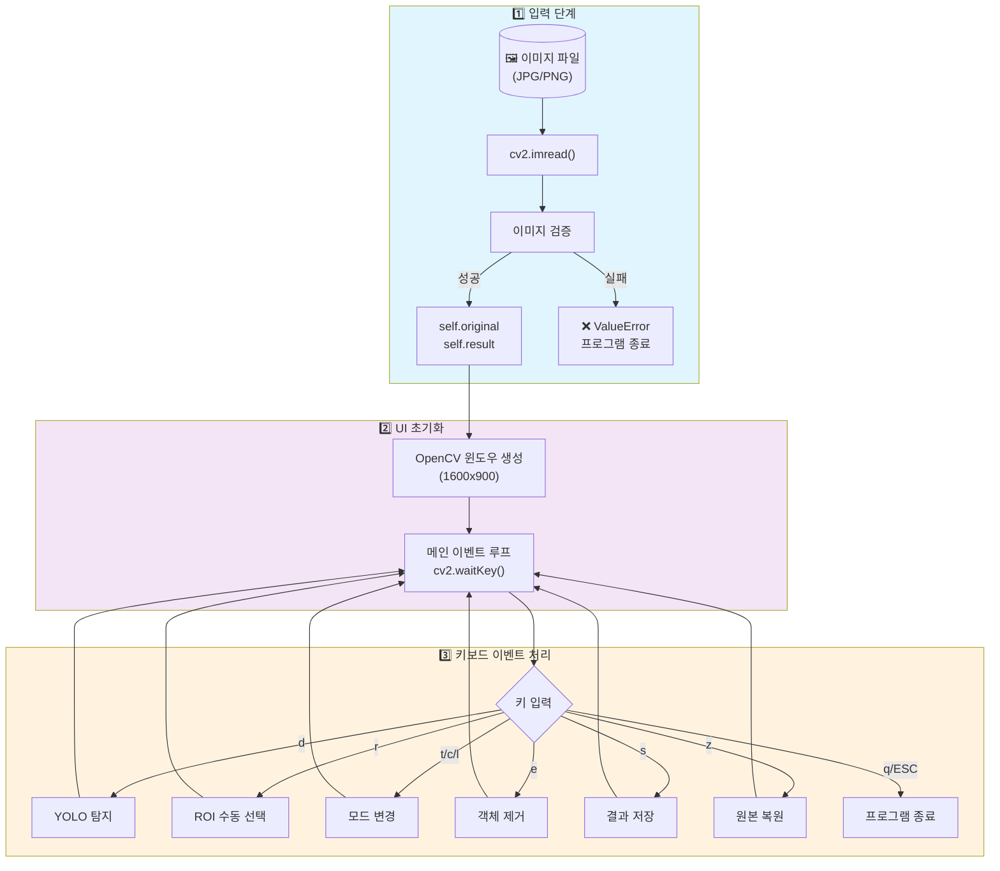

---

## 상세 파이프라인

### 1. YOLO 객체 탐지 파이프라인 (키: `d`)

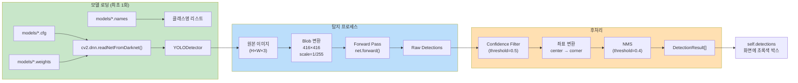

### 2. 수동 ROI 선택 파이프라인 (키: `r`)

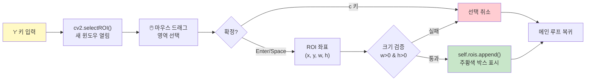

### 3. 마스크 생성 파이프라인

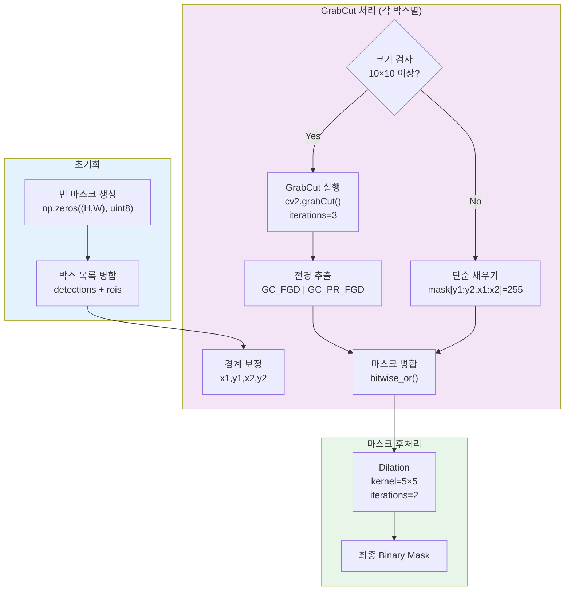

### 4. 인페인팅 파이프라인 (키: `e`)

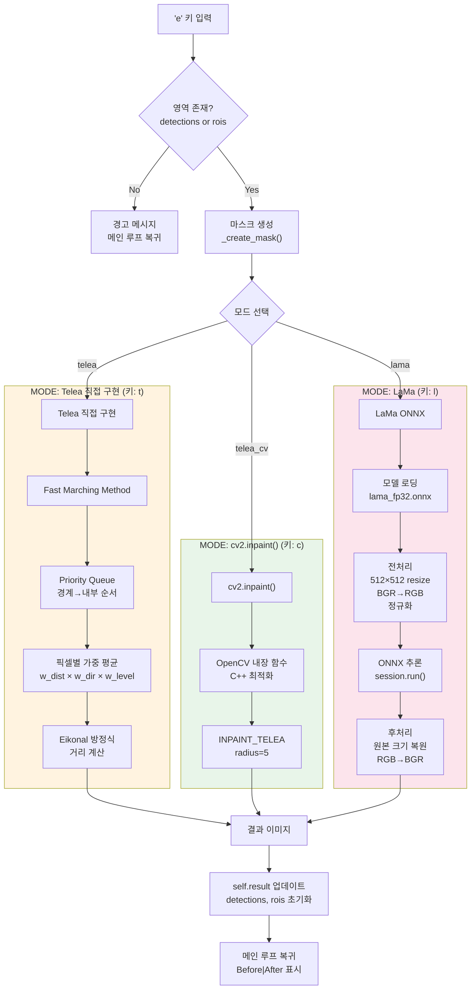

---

## Telea 알고리즘 상세

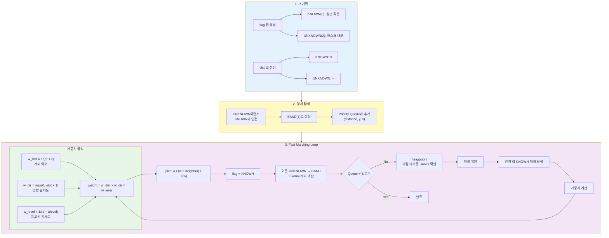

---

## LaMa 추론 파이프라인

```mermaid
flowchart LR
    subgraph INPUT["입력"]
        A["원본 이미지<br/>(H×W×3, BGR)"]
        B["마스크<br/>(H×W, uint8)"]
    end

    subgraph PREPROCESS["전처리"]
        C["스케일 계산<br/>scale = 512/max(H,W)"]
        D["리사이즈<br/>(new_h, new_w)"]
        E["패딩<br/>512×512<br/>mode='reflect'"]
        F["BGR → RGB"]
        G["정규화<br/>[0,255] → [0,1]"]
        H["차원 변환<br/>HWC → NCHW"]
    end

    subgraph INFERENCE["ONNX 추론"]
        I["img: (1,3,512,512)"]
        J["mask: (1,1,512,512)"]
        K["session.run()"]
        L["output: (1,3,512,512)"]
    end

    subgraph POSTPROCESS["후처리"]
        M["NCHW → HWC"]
        N["클리핑 [0,255]<br/>→ uint8"]
        O["패딩 제거"]
        P["원본 크기 리사이즈"]
        Q["RGB → BGR"]
    end

    A --> C
    B --> C
    C --> D --> E --> F --> G --> H
    H --> I
    B --> J
    I --> K
    J --> K
    K --> L --> M --> N --> O --> P --> Q
    Q --> R["결과 이미지<br/>(H×W×3, BGR)"]

    style INPUT fill:#bbdefb
    style PREPROCESS fill:#c8e6c9
    style INFERENCE fill:#ffe0b2
    style POSTPROCESS fill:#f8bbd9
```

---

## 사용자 흐름 (User Flow)

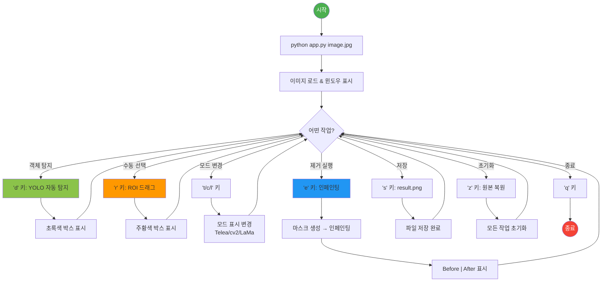

---

## 인페인팅 모드 비교

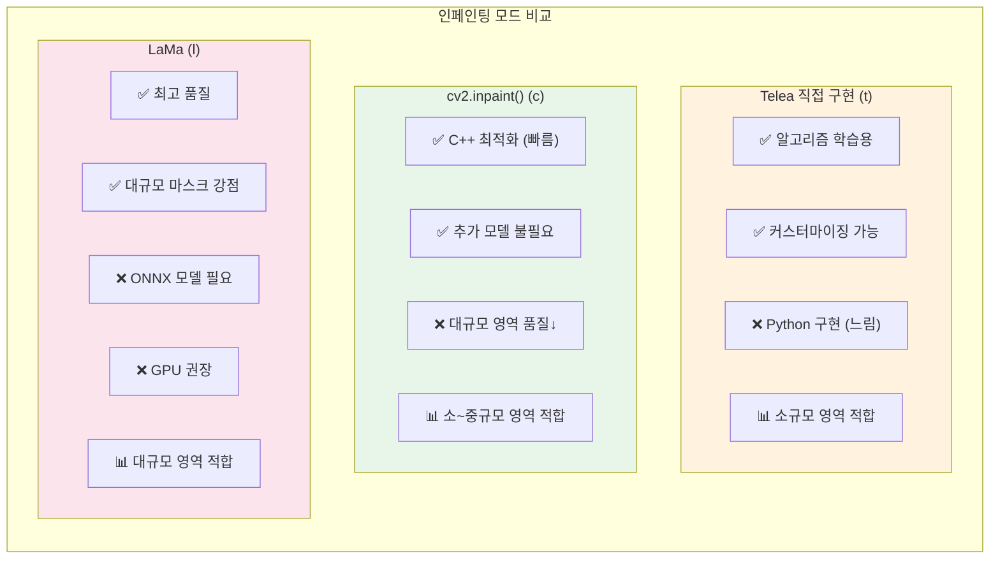

---

## 모듈 의존성 그래프

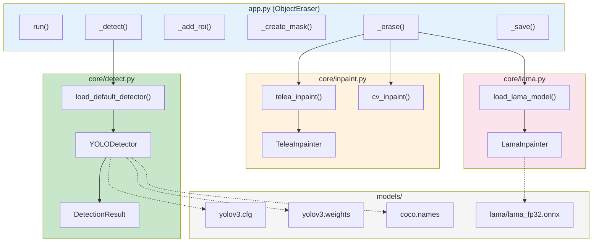

---

## 데이터 구조

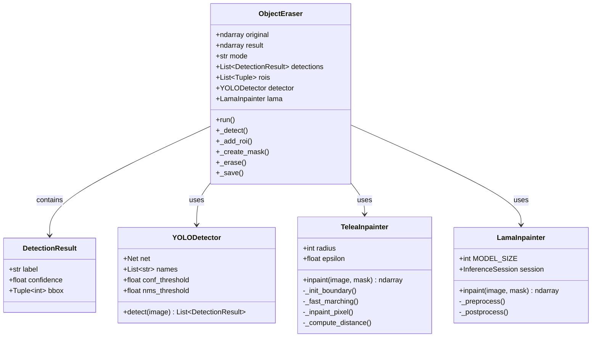

---

## 실행 예시

```bash
# 1. 가상환경 활성화
source .venv/bin/activate

# 2. 애플리케이션 실행
python app.py photo.jpg

# 3. 키보드 조작
# d → 객체 자동 탐지
# r → ROI 수동 선택
# t/c/l → 모드 변경
# e → 제거 실행
# s → 저장
# z → 복원
# q → 종료
```
